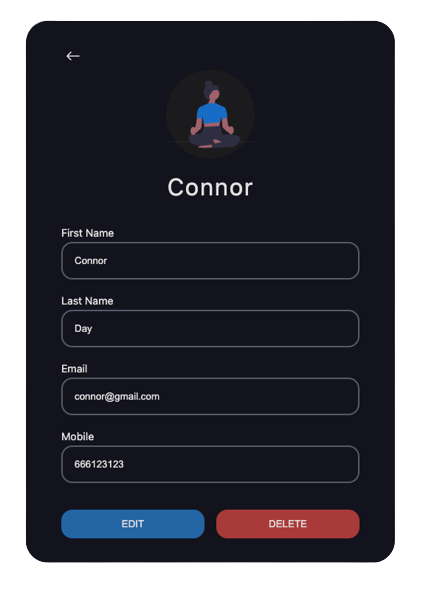

# Contacts app



## Getting started

### Run the project:

```sh
cd docker
docker-compose up
```

Then, open [http://localhost:3000](http://localhost:3000)

### If you need to rebuild the image:

```sh
docker-compose down
docker-compose build
docker-compose up
```

Then, open [http://localhost:3000](http://localhost:3000)

## Stack

Frontend:

- [Next.js](https://nextjs.org/)
- [React Query](https://tanstack.com/query/v4)

Backend:

- [Node.js](https://nodejs.org/)
- [MongoDB and Mongoose](https://www.mongodb.com/developer/languages/javascript/getting-started-with-mongodb-and-mongoose/)
